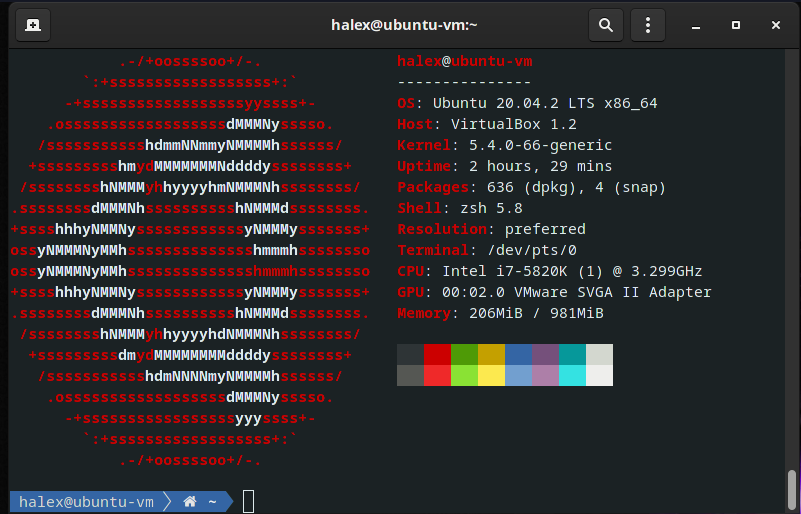

# Shell configuration

Install zsh
```
sudo apt install zsh
```

Make zsh default shell
```
chsh -s $(which zsh)
```

Install oh-my-zsh
```
sh -c "$(curl -fsSL https://raw.github.com/robbyrussell/oh-my-zsh/master/tools/install.sh)"
```

Install powerlevel10k
```
git clone https://github.com/romkatv/powerlevel10k.git $ZSH_CUSTOM/themes/powerlevel10k
```

Change `.zshrc`
```
ZSH_THEME="powerlevel10k/powerlevel10k"
```

Run p10k configure or copy `.p10k.zsh` configuration file

Add `[[ ! -f ~/.p10k.zsh ]] || source ~/.p10k.zsh` to `.zshrc` if not already added

Run `source .zshrc` or re-open terminal

### Additional flex

```
sudo apt install neofetch
```

Add `neofetch` in `.zshrc` and of course re-open terminal to see effect

### Final result


